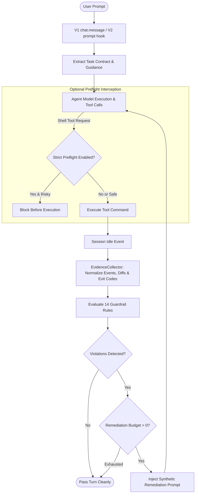

# opencode-guardian 🛡️

[](https://opensource.org/licenses/MIT)
[](https://www.npmjs.com/package/opencode-guardian)
[](https://opencode.ai)
[](https://www.typescriptlang.org/)
[](https://github.com/huseyincig/opencode-guardian/actions/workflows/ci.yml)

A high-performance, deterministic quality, safety, and verification plugin for **OpenCode** AI coding agents.

OpenCode Guardian continuously supervises agent turns: guiding model execution before calls, correlating tool results at session idle, intercepting destructive shell actions, and enforcing that agents verify their work with genuine post-change evidence before declaring tasks complete.

---

## Key Highlights

- **Dual-Mode Architecture:** Seamlessly supports both **OpenCode v1** (`@opencode-ai/plugin`) and **OpenCode v2** (`@opencode/plugin`) with unified runtime adapters.
- **Compact TUI Sidebar:** Modern 2-column key-value widget matching the clean aesthetic of CortexKit and OMO-Slim. Expands with a single click.
- **In-App Update Indicator:** Automatically notifies you directly in the TUI header with a green `(↑)` indicator when a newer version is published to npm.
- **Project-Scoped Telemetry:** Stores event metrics locally inside `<project>/.opencode/guardian-events.jsonl` with secure `0600` POSIX permissions, keeping each project's statistics independent across sessions.
- **Evidence-Based Task Contracts:** Analyzes human requests across 13 languages to extract required verifications (tests, builds, source reviews) and prevents premature task exits without proof.
- **14 Deterministic Rules:** Blocks shortcuts, empty stubs, unverified claims, masked errors, test weakening, leaked secrets, undeclared dependencies, and repetitive execution loops.
- **Zero Configuration:** Works instantly out of the box with production-tested defaults. Fully configurable via `opencode-guardian.json`.
- **Zero Runtime Dependencies:** Standalone precompiled JavaScript (`dist/`) requiring no external server dependencies.

---

## Installation

Add `opencode-guardian` to your OpenCode configuration (`opencode.json` in your project or `~/.config/opencode/opencode.json`):

### OpenCode v1 & v2

```json
{
  "plugin": [
    "opencode-guardian@latest"
  ]
}
```

### Local / Development

```json
{
  "plugin": [
    "file:///path/to/opencode-guardian"
  ]
}
```

---

## TUI Sidebar Interface

OpenCode Guardian includes a dedicated TUI extension that mounts into OpenCode's sidebar. It displays live status, intervention counters, and update notices.

### Collapsed View (Default)

```text
▶ Guardian                 v0.5.0 (↑)
Status                       ● Active
Interventions                 0w · 0r
```

- **Header:** Clickable header displaying the Guardian brand, current version, and an optional green `(↑)` update badge when a newer npm release is detected.
- **Status:** Real-time health (`● Active`, `● 1 warn`, or `● 1 blocked`).
- **Interventions:** Compact summary of warnings (`w`) and automatic remediations (`r`).

### Expanded View (Click to Toggle)

```text
▼ Guardian                 v0.5.0 (↑)
Preflight                  ○ disabled
Inspected                           0
Blocked                             0
Warnings                            0
Remediations                        0
Update                         v0.5.1
```

- **Preflight:** Current shell protection mode (`○ disabled` or `● active`).
- **Inspected / Blocked:** Real-time count of commands evaluated and prevented.
- **Warnings / Remediations:** Detailed intervention statistics for the active project.
- **Update:** Displays the newest available version from the npm registry.

---

## The 14 Guardrail Rules

OpenCode Guardian evaluates every assistant turn against 14 deterministic rules:

| Category | Rule ID | Default | What It Enforces |
| :--- | :--- | :---: | :--- |
| **Discipline** | `discipline/no-evasion` | `error` | Blocks unsupported dismissals such as claiming a test failure is "pre-existing" or "out of scope" unless verified by baseline checks. |
| **Discipline** | `discipline/no-apology` | `error` | Blocks sycophantic, defensive, or repetitive apology language across multiple languages. |
| **Quality** | `quality/no-shortcuts` | `error` | Blocks concrete deferred-work phrases (`TODO`, `FIXME`, `HACK`, "will do later"). Ambiguous hedging phrases are flagged as advisory warnings. |
| **Integrity** | `integrity/no-stubs` | `error` | Blocks `NotImplementedError`, empty function stubs, Rust `todo!()`/`unimplemented!()`, and placeholder returns. |
| **Integrity** | `integrity/no-unverified-claims` | `error` | Correlates statements like "tests pass" or "build succeeded" against recorded tool exit codes. Direct contradictions block. |
| **Integrity** | `integrity/no-silent-failure` | `error` | Blocks test, build, lint, typecheck, or audit commands masked with `\|\| true`, `exit 0`, or suppressed exit codes. |
| **Safety** | `safety/no-truncation` | `error` | Blocks lazy edit placeholders (e.g. `// ... rest of code unchanged ...`) that can accidentally truncate production code. |
| **Safety** | `safety/destructive-operations` | `warn` | Inspects hard resets, force pushes, recursive deletion (`rm -rf`), database drops, and unpublish actions. Plain `rm` requires explicit scoped user consent. |
| **Testing** | `testing/no-cheat` | `error` | Blocks malicious test tampering: targeted `describe.skip`, `it.skip`, `test.skip`, `fit`, or assertion stripping in test files. |
| **Security** | `security/no-secrets` | `error` | Blocks hardcoded API keys (OpenAI, Anthropic, Google, AWS, GitHub, Slack, Stripe, JWTs, private keys, database URLs with passwords). |
| **Manifest** | `manifest/no-ghost-deps` | `error` | Blocks undeclared third-party imports not found in `package.json`, `pyproject.toml`, `requirements.txt`, `go.mod`, or `Cargo.toml`. Local modules and stdlib are recognized. |
| **Runtime** | `runtime/circuit-breaker` | `error` | Blocks repetitive failing commands hitting identical errors 3 times consecutively without progress, breaking runaway agent loops. |
| **Task** | `task/instruction-fidelity` | `error` | Prevents the agent from refusing an explicit task solely because the user previously paused or deferred it in an earlier turn. |
| **Task** | `task/completion-gate` | `error` | Ensures requested verifications (fresh test execution, post-change source inspection) are observed before the agent declares completion. |

---

## Configuration (`opencode-guardian.json`)

Guardian works out of the box with zero configuration. You can customize rules and thresholds by placing `opencode-guardian.json` in your project root, `.opencode/`, or `~/.config/opencode/`:

```json
{
  "$schema": "https://opencode.ai/config.json",
  "enabled": true,
  "remediationBudget": 1,
  "iterationBudget": 3,
  "updateNotice": {
    "enabled": true
  },
  "preflight": {
    "enabled": false
  },
  "rules": {
    "discipline/no-evasion": "error",
    "discipline/no-apology": "error",
    "quality/no-shortcuts": {
      "severity": "error",
      "customPhrases": ["not my job", "out of scope for me"],
      "exceptions": ["tempdir", "temporaryfile"]
    },
    "integrity/no-stubs": "error",
    "integrity/no-unverified-claims": "error",
    "integrity/no-silent-failure": "error",
    "safety/no-truncation": "error",
    "safety/destructive-operations": "warn",
    "testing/no-cheat": "error",
    "security/no-secrets": "error",
    "manifest/no-ghost-deps": "error",
    "runtime/circuit-breaker": "error",
    "task/instruction-fidelity": "error",
    "task/completion-gate": "error"
  }
}
```

### Severity Options:
- `"error"`: High-confidence violation triggers an automatic remediation prompt (bounded by `remediationBudget`).
- `"warn"`: Recorded in telemetry and displayed in TUI, but does not interrupt agent flow.
- `"off"`: Completely disables the rule.

---

## Task Contracts & Multilingual Support

When a user submits an instruction, Guardian extracts a deterministic task contract before model execution. Supported intent patterns include:
- **Languages Supported:** English, Turkish, Spanish, Portuguese, French, German, Russian, Arabic, Hindi, Chinese, Japanese, Korean, and Indonesian.
- **Verification Modes:** Requires observable evidence (e.g. running tests, building, typechecking, or performing a fresh post-change file inspection).
- **Explicit Header Directive (Optional):** For deterministic contract specification regardless of natural language phrasing:

```text
@guardian-task {"mode":"iterative-review","review":"source","verify":["test"]}
Please refactor the authentication service and verify all tests pass.
```

---

## Preflight Shell Protection (Opt-In)

By default, Guardian analyzes operations after tool execution. If you want **pre-execution blocking** that intercepts dangerous shell commands *before* they are sent to the terminal, enable preflight:

```json
{
  "preflight": {
    "enabled": true
  }
}
```

- Intercepts destructive commands (`rm -rf /`, `git reset --hard`, `DROP DATABASE`, `mkfs`, fork bombs, encoded base64 pipelines).
- Operates at the host hook level (`tool.execute.before` in v1, `ctx.tool.hook("execute.before")` in v2).

---

## Telemetry & CLI Status

Guardian maintains a private, redacted log of local events:
- **Project Log:** `<project>/.opencode/guardian-events.jsonl` (mode `0600`).
- **Global Fallback:** `~/.local/state/opencode-guardian/guardian-events.jsonl`.
- **Privacy:** Contains only rule codes and SHA-256 session fingerprints. **Never** stores commands, file contents, secrets, or prompts.

### Command Line Interface

Check Guardian's status at any time from your terminal:

```bash
# Check status for the current project
opencode-guardian-status

# Or specify a target directory
opencode-guardian-status /path/to/project
```

Example output:
```text
Guardian | preflight at last start: disabled
Shell inspected: 14 | blocked: 0
Post-turn warnings: 2 | remediations: 1 | errors: 0
Event log: /path/to/project/.opencode/guardian-events.jsonl
```

---

## Architecture & Turn Lifecycle



---

## Verification & Testing

OpenCode Guardian is backed by a comprehensive automated test suite:

```bash
# Run unit and regression tests (346 tests)
npm test

# Run TypeScript typechecks
npm run typecheck

# Run end-to-end scenario test suite (18 scenarios)
node sandbox/comprehensive-test.mjs

# Verify package contents
npm pack --dry-run
```

---

## License

MIT © [Hüseyin Hadi Çığ](https://github.com/huseyincig)
