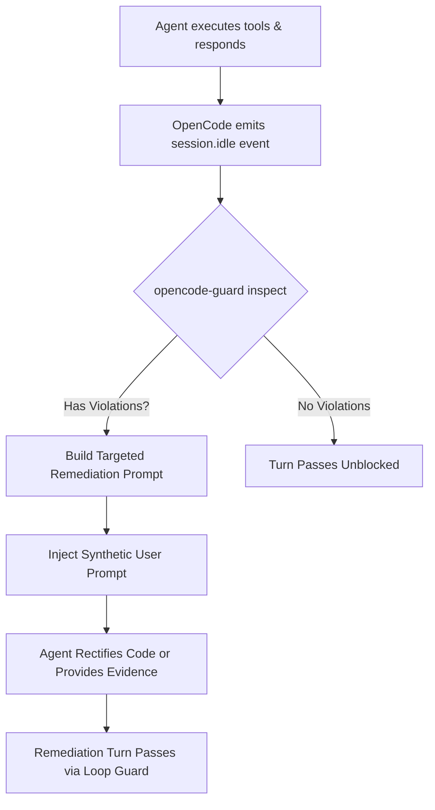

# opencode-guard 🛡️

[](https://opensource.org/licenses/MIT)
[](https://github.com/huseyincig/opencode-guard)
[](https://www.typescriptlang.org/)
[](tests/)

A universal, high-performance quality and safety guard plugin for **OpenCode** AI agents.

Designed to prevent common AI agent bad habits: responsibility evasion, hedging shortcuts, empty stub implementations, lazy code truncation, test skipping, hardcoded secrets, undeclared dependencies, and repetitive error loops.

---

## 🌟 Why OpenCode Guard?

Traditional agent detectors often rely on external platform-specific binaries (Rust, Go, or Python) which introduce compile issues, glibc mismatches, and sluggish child-process invocation. 

**OpenCode Guard** provides:
- **Zero-Binary, Pure TypeScript:** Native in-memory execution (~0.5ms per inspection) with zero runtime dependencies.
- **Dual-Mode Host Support:** Works seamlessly with both **OpenCode 1.x** (via `server` hook) and **OpenCode 2.x** (via `setup` and `event.subscribe`).
- **Pre-Built Distribution:** Pre-compiled `dist/` is included in the repository—no build toolchain (`tsc`) required on target systems.
- **Zero False-Positives:** Localized exception boundaries (e.g., `TemporaryDirectory` won't mask subsequent hedging), AST/patch header extraction, and template variable filtering.
- **Anti-Loop Architecture:** Automatically detects synthetic remediation prompts to ensure the agent never gets trapped in an infinite feedback loop.

---

## 📦 Installation

You do **not** need an npm registry release to install and use this plugin right now. Choose any of the methods below:

### Method 1: Local Directory / Vendor (Recommended)

Clone or symlink the repository into your OpenCode vendor or plugins directory:

```bash
git clone https://github.com/huseyincig/opencode-guard.git ~/.config/opencode/vendor/opencode-guard
```

Then add the absolute `file:///` path to your OpenCode configuration (`~/.config/opencode/opencode.json`):

```json
{
  "plugin": [
    "file:///root/.config/opencode/vendor/opencode-guard"
  ]
}
```

Because the pre-compiled `dist/` files are tracked in git, it is ready to run immediately with no build step required.

### Method 2: NPM (Once Published)

Once published to npm or an internal registry:

```json
{
  "plugin": [
    "opencode-guard@latest"
  ]
}
```

---

## 🛡️ The 9 Universal Rules

| Rule ID | Category | What it Prevents | Examples Blocked |
| :--- | :--- | :--- | :--- |
| **`discipline/no-evasion`** | Discipline | Evading responsibility or dismissing errors as out-of-scope or pre-existing. | *"unrelated to this change"*, *"already broken on main"*, *"outside the scope of this PR"* |
| **`discipline/no-apology`** | Discipline | Sycophantic, defensive, or excessive apologies and conversational filler. | *"I apologize for the confusion"*, *"I am so sorry"*, *"çok özür dilerim"*, *"kusura bakmayın"* |
| **`quality/no-shortcuts`** | Quality | Hedging language, temporary fixes, and lingering marker comments. | *"good enough for now"*, *"basic implementation"*, *"temporary fix"*, `TODO`, `FIXME` |
| **`integrity/no-stubs`** | Integrity | Claiming completion while leaving hollow placeholder methods or stubs. | `throw new NotImplementedError`, `raise NotImplementedError`, `def ...: pass` |
| **`safety/no-truncation`** | Safety | Lazy truncation comments that delete real code during file edits. | `// ... existing code unchanged ...`, `# ... rest of code ...` |
| **`testing/no-cheat`** | Testing | Weakening test suites to fake a green test run. | `test.skip()`, `it.only()`, commented-out assertions (`// expect(...)`) |
| **`security/no-secrets`** | Security | Hardcoding raw API keys, private tokens, or database credentials. | `sk-...`, `ghp_...`, `AKIA...`, `xoxb-...`, raw database connection strings |
| **`manifest/no-ghost-deps`** | Manifest | Importing third-party packages not listed in `package.json`. | Importing `lodash` or `axios` when not declared in dependencies. |
| **`runtime/circuit-breaker`** | Runtime | Repeating the exact same failing tool command 3+ times in a single turn. | Database connection refused retry storms, missing path error loops. |

---

## ⚙️ Configuration (`opencode-guard.json`)

OpenCode Guard works out of the box with zero configuration (all rules enabled with `error` severity).

To customize behavior, create an `opencode-guard.json` file in your project root or `~/.config/opencode/opencode-guard.json`:

```json
{
  "enabled": true,
  "rules": {
    "discipline/no-evasion": "error",
    "quality/no-shortcuts": {
      "severity": "error",
      "customPhrases": ["works on my machine", "not my job"],
      "exceptions": ["temporarydirectory", "tempdir"]
    },
    "integrity/no-stubs": "error",
    "safety/no-truncation": "error",
    "testing/no-cheat": "error",
    "security/no-secrets": "error",
    "manifest/no-ghost-deps": "warn",
    "runtime/circuit-breaker": "error"
  }
}
```

### Severity Levels:
- `"error"`: **Blocks** the agent turn and sends a synthetic remediation prompt instructing the agent to fix the issue.
- `"warn"`: Records the finding in rule results but **does not block** the agent from completing its turn.
- `"off"`: Completely disables the rule.

---

## 🔄 How It Works: Lifecycle & Remediation Flow



1. **Inspection on Idle:** When the AI agent completes its actions, OpenCode triggers `session.idle`.
2. **Deep Turn Analysis:** The Guard inspects the assistant's text and all tool inputs (file edits, writes, patches) against active rules.
3. **Structured Remediation:** If a violation is caught, a structured, actionable remediation prompt is sent back to the agent with the exact offending snippet.
4. **Loop Protection:** When the agent responds to the remediation prompt (`synthetic: true`), the engine detects this and allows the response through, preventing deadlock.

---

## 🧪 Testing & Verification

The repository comes with a comprehensive test suite covering unit behaviors and end-to-end sandbox simulations.

```bash
# Run 20/20 unit tests (~55ms)
npm test

# Run isolated sandbox end-to-end suite (10 scenarios)
node sandbox/comprehensive-test.mjs

# Run sandbox smoke test
node sandbox/smoke-test.mjs
```

### Test Suite Highlights:
- **20 Unit Tests:** Validates every rule pattern, localized exception boundaries, object error serialization, and severity handling.
- **10 E2E Scenarios:** Verifies blocking of all 8 violation types, plus 2 clean passes verifying zero false-positives and loop continuation.

---

## 🛠️ Project Structure

```
opencode-guard/
├── dist/                # Pre-compiled ESM distribution files (tracked for zero-build installs)
├── src/
│   ├── index.ts         # Dual-Mode entry point (OpenCode v1 server & v2 setup)
│   ├── engine.ts        # GuardEngine inspection orchestrator & config loader
│   ├── types.ts         # TypeScript interfaces & definitions
│   └── rules/           # The 8 modular rule implementations
├── sandbox/             # Isolated sandbox environment for testing
│   ├── comprehensive-test.mjs
│   └── smoke-test.mjs
├── tests/
│   └── guard.test.mjs   # Comprehensive unit test suite
├── package.json
├── tsconfig.json
├── LICENSE              # MIT License
└── README.md
```

---

## 📄 License

[MIT](LICENSE) © Hüseyin Hadi Çığ
